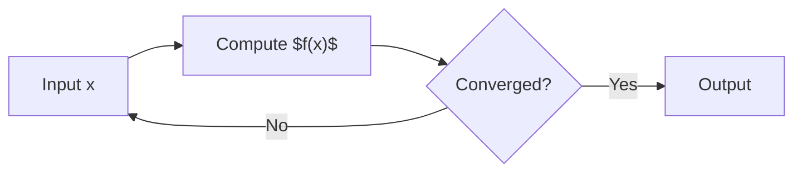

# LaTeX Math Test

## Inline Math

The quadratic formula is $x = \frac{-b \pm \sqrt{b^2 - 4ac}}{2a}$ and Euler's identity is $e^{i\pi} + 1 = 0$.

The derivative of $f(x) = x^n$ is $f'(x) = nx^{n-1}$.

## Block Math

$$
\int_{-\infty}^{\infty} e^{-x^2} dx = \sqrt{\pi}
$$

$$
\sum_{n=1}^{\infty} \frac{1}{n^2} = \frac{\pi^2}{6}
$$

$$
\nabla \times \mathbf{E} = -\frac{\partial \mathbf{B}}{\partial t}
$$

## Matrix

$$
\begin{pmatrix}
a & b \\
c & d
\end{pmatrix}
\begin{pmatrix}
x \\
y
\end{pmatrix}
=
\begin{pmatrix}
ax + by \\
cx + dy
\end{pmatrix}
$$

## Mixed Content

Given a graph with adjacency matrix $A$, the number of walks of length $k$ from vertex $i$ to $j$ is $(A^k)_{ij}$.

The algorithm converges when $|f(x_{n+1}) - f(x_n)| < \epsilon$.
